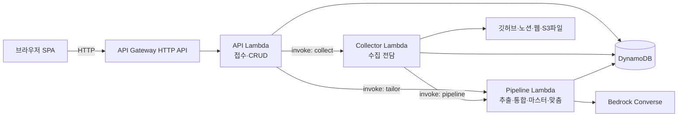
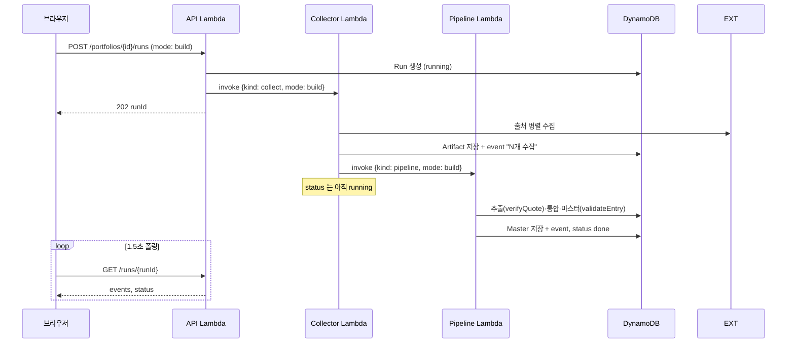
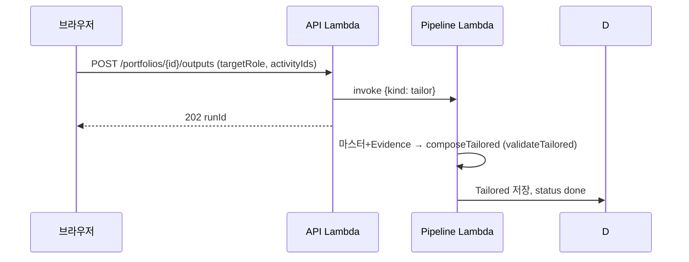

# 백엔드 아키텍처 (C안: 수집 분리)

_갱신: 2026-09-20 · Lambda 기능별 분리 리팩토링 반영_

## 분할 요약

**수집(Collector)** 을 독립 Lambda로 떼어내고, **AI 파이프라인(추출~통합~마스터)** 을 하나로 묶었다.
Step Functions 없이 **Lambda 간 직접 비동기 호출**(JobInvoker)로 단계를 잇는다.

- **API Lambda** — 접수(runId 발급) 후 다음 단계를 비동기 invoke. 30초 제한 회피.
- **Collector Lambda** — 출처 병렬 수집 → Artifact 저장 → 파이프라인 invoke.
- **Pipeline Lambda** — 추출→통합→마스터(build/refresh), 그리고 tailor(직무 맞춤).

## 전체 구조



## build 흐름 (정리하기)



## tailor 흐름 (직무 맞춤)

수집이 필요 없으므로 API가 Pipeline Lambda를 **바로** 부른다.



## 단계 간 체이닝 (Step Functions 대신)

`JobInvoker` 포트 하나가 단계 연결을 추상화한다.

```
Job = CollectJob | PipelineJob | TailorJob   (discriminated union, kind 로 구분)
  CollectJob  { kind:'collect',  mode, portfolioId, runId }
  PipelineJob { kind:'pipeline', mode, portfolioId, runId }
  TailorJob   { kind:'tailor',   portfolioId, runId, targetRole, jdText?, selectedActivityIds }

JobInvoker.invoke(job)  — 실제: Lambda invoke(InvocationType='Event')
                          테스트: 인메모리 즉시 실행(체이닝 재현)
```

- **API → Collector**: `invoke({kind:'collect', mode})`
- **Collector → Pipeline**: `runCollect` 가 수집 끝에 `invoke({kind:'pipeline', mode})`
- **API → Pipeline(tailor)**: `invoke({kind:'tailor', ...})`

## 코드 매핑

| Lambda | 핸들러 | 도메인 함수 | 순수 로직 |
|---|---|---|---|
| API | `api/handler.ts` `handleApiEvent` | `api/api.ts` `handle` | 10개 엔드포인트 라우팅 |
| Collector | `collector/handler.ts` `handleCollect` | `worker/worker.ts` `runCollect` | `collect/*` (github·web·notion·file) |
| Pipeline | `pipeline/handler.ts` `handlePipeline` | `worker/worker.ts` `runPipeline`·`runTailor` | `pipeline/*` (extract·consolidate·master·refresh·tailor) |

- 도메인 함수(`runCollect`/`runPipeline`/`runTailor`)는 순수하게 `Deps` 주입만 받는다 → 테스트에서 인메모리로 전 흐름 검증.
- 핸들러는 이벤트 파싱 + 도메인 호출만 하는 얇은 층. AWS 엔트리(`export const handler`)는 SDK 연결 후 활성화(주석 TODO).

## build vs refresh (Pipeline 안에서)

- **build**: 저장된 Artifact 전부 추출.
- **refresh**: 이전 Evidence 가 참조하지 않는(=내용이 바뀌어 새 id 가 된) Artifact 만 재추출. 나머지 Evidence 유지.
  - 결정론적 id(evidence=내용해시, activity=근거집합해시) 덕분에 변경분만 자연히 걸러진다.
  - 마스터 재작성 시 `lockedFields`(사용자가 고친 칸) 보존.

## 검증

- 백엔드 42 tests (핸들러 체이닝·collect/pipeline 분리·refresh·tailor·API end-to-end 포함).
- shared 11 + frontend 5 = 전체 58 tests 통과.

## AWS 연결 시 남은 것 (자격증명 후)

- `JobInvoker` 실제 구현 `LambdaJobInvoker` (`@aws-sdk/client-lambda`, InvocationType='Event').
- 각 핸들러의 `buildXxxDeps()` — DynamoStore/S3Blob/BedrockConverse/FetchHttp 조립.
- SAM `template.yaml`: API/Collector/Pipeline Lambda 3개 + API Gateway + DynamoDB + S3 + IAM(각 invoke 권한).
  - Collector·Pipeline 은 제한 시간 15분, 비동기 호출.
