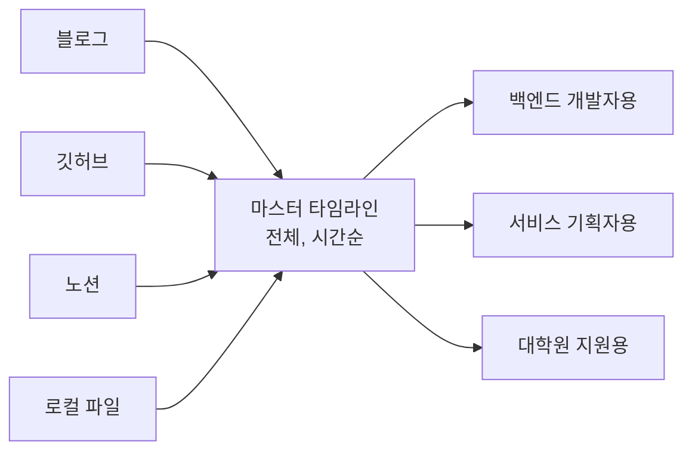
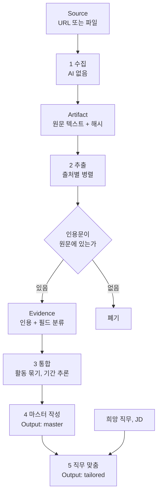
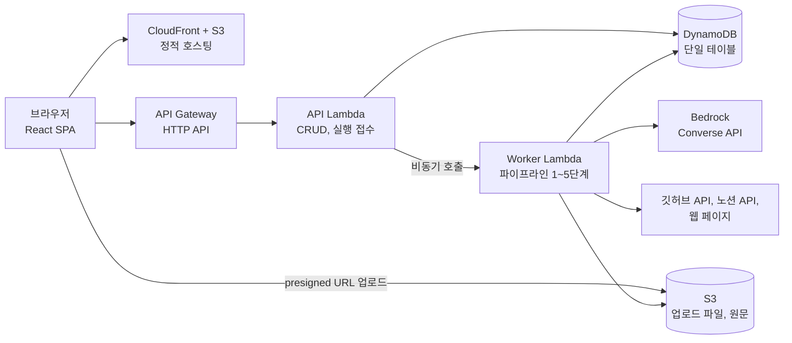
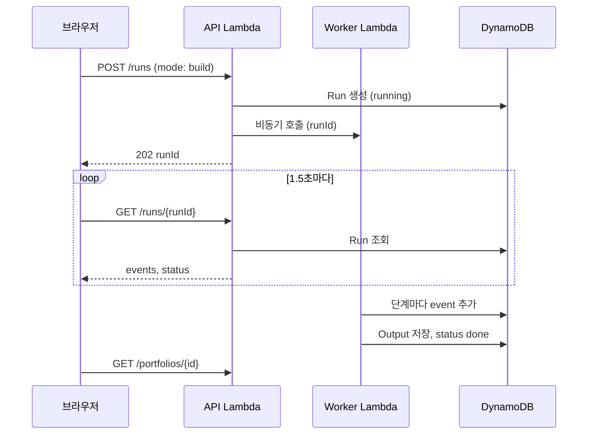

# 포트폴리오 생성기 — 확장 기획 및 설계 문서

_2026-09-20_

## 1. 개요

기존 기획서의 "링크 → 정리된 포트폴리오"를 1차 목표로 두고, 그 위에 "직무 맞춤 2차 가공"을 얹는다. 두 목표는 별개 기능이 아니라 같은 데이터(근거 저장소)를 공유하는 두 개의 출력이다.

| 구분 | 기존 기획서 초안 | 이 문서에서 확장하는 것 |
|---|---|---|
| 입력 | 공개 URL | 공개 URL + 로컬 파일(PDF, 문서, 이미지) |
| 1차 결과물 | 표준 폼으로 정리된 포트폴리오 | 동일. 다만 "마스터 타임라인"으로 역할을 재정의 |
| 2차 결과물 | 확장 방향에 한 줄(목적별 버전) | 핵심 기능으로 승격: 희망 직무에 맞춘 제출용 포트폴리오 |
| 환각 방지 | "억지로 채우지 않는다"는 원칙 | 구조로 강제: 모든 문장이 원문 인용(Evidence)에 연결 |
| 저장 대상 | 주소만 저장 | 주소가 원본, 내용은 캐시(변경 감지용) |
| 인프라 | 미정 | AWS 서버리스(Lambda, DynamoDB, S3, Bedrock) |
| 개발 방식 | 미정 | Kiro spec 기반, 타입 계약 먼저 고정 후 병렬 작업 |

이 문서는 기획 추가안(2~3장), 설계(4~7장), Kiro 작업 방식과 해커톤 범위(8~9장) 순서로 읽는다.

## 2. 제품 컨셉: 창고와 진열대

1차 목표는 창고를 만드는 일이고, 2차 목표는 그 창고에서 꺼내 진열대를 꾸미는 일이다. 옷가게에 비유하면 창고에는 가진 옷이 전부 입고일 순으로 걸려 있고, 진열대에는 오늘 올 손님에게 맞는 옷만 골라 세워둔다. 진열대에 세우려고 없는 옷을 새로 만들지는 않는다.

| | 1차: 마스터 타임라인 (창고) | 2차: 직무 맞춤 포트폴리오 (진열대) |
|---|---|---|
| 질문 | 나는 지금까지 뭘 했나 | 이 직무에 나를 어떻게 보여줄까 |
| 독자 | 본인 | 채용 담당자 |
| 범위 | 전부, 빠짐없이 | 선택한 활동만 |
| 순서 | 시간순 | 직무 관련도순 |
| 문체 | 중립적 사실 기술 | 직무 역량을 강조하는 서술 |
| 개수 | 1개 (계속 갱신) | 직무마다 1개씩 |
| AI의 자유도 | 낮음: 배치와 문체 통일만 | 중간: 선별, 강조, 재서술. 단 새 사실 추가는 금지 |

핵심 규칙은 하나다. **2차 가공은 1차에서 확보한 근거 밖으로 나가지 못한다.** 그래서 "직무에 맞게 꾸미지만 지어내지 않는다"를 심사에서 말할 수 있다.



마스터는 하나이고 맞춤본은 여러 개다. 원본이 바뀌면 마스터가 갱신되고, 맞춤본에는 "원본이 바뀜" 표시가 붙는다.

## 3. 기획서에 추가할 내용

추가는 네 가지, 초안에서 고쳐 써야 할 주장은 세 가지다.

### 추가 1. 로컬 파일 입력

공모전 기획서 PDF, 발표 자료, 수상 증빙 사진처럼 링크가 없는 기록을 파일로 올린다. 링크와 같은 파이프라인을 타고 같은 폼으로 정리된다. 인스타그램은 수집이 사실상 막혀 있으므로, 동아리 활동 사진은 이 경로로 받는다.

### 추가 2. 직무 맞춤 포트폴리오 (2차 목표)

사용자 흐름은 세 단계다.

1. 희망 직무를 적는다. 채용공고(JD) 본문을 붙여넣으면 더 정확해진다.
2. 마스터 타임라인에서 넣을 활동을 체크한다. AI가 관련도순으로 추천 체크를 미리 해둔다.
3. "만들기"를 누르면 그 직무의 언어로 다시 쓴 제출용 포트폴리오가 나온다.

AI가 하는 일은 다음과 같다.

- **직무 해석**: 직무명이나 JD에서 요구 역량 5~8개를 뽑는다.
- **선별과 정렬**: 활동을 역량 관련도순으로 재배열한다.
- **재서술**: 같은 활동이라도 백엔드 지원용은 기술적 문제 해결을, 기획 지원용은 문제 정의와 협업을 앞에 둔다.
- **자기소개 요약**: 선택된 활동의 근거만으로 상단 3~4문장 소개를 쓴다.
- **공백 리포트**: JD가 요구하는데 근거가 없는 역량을 "근거 없음"으로 알려준다. 기존 기획서의 "빈 칸 표시"가 직무 단위로 확장된 것이다.

### 추가 3. 근거 추적 (문장을 누르면 원문이 보인다)

포트폴리오의 모든 문장은 원문 인용에 연결된다. 문장을 클릭하면 어느 링크의 어느 구절에서 왔는지 보인다. 맞춤본에서도 동일하게 동작하므로, 채용 제출용 문서에서 가장 위험한 "AI가 부풀린 경력"을 구조적으로 막는다.

### 추가 4. 변경분만 다시 읽는 갱신

"다시 불러오기"는 모든 링크를 다시 읽되, 내용 해시가 바뀐 출처만 AI 처리를 다시 돌린다. 데모에서 갱신이 빨라지고 비용도 줄어든다.

### 초안에서 고쳐 써야 할 주장

| 초안의 주장 | 문제 | 수정안 |
|---|---|---|
| "우리는 내용이 아니라 주소를 저장한다" | 변경 감지와 근거 추적을 하려면 추출한 내용을 저장해야 한다. 로컬 파일은 주소가 없다 | "원본은 주소에 있고, 우리는 사본을 캐시한다. 원본이 바뀌면 사본을 버린다" |
| "본문 텍스트만 긁으면 어디서든 가져온다" | 노션 공개 페이지는 자바스크립트로 그려져서 단순 요청으로는 본문이 비어 온다 | 노션만 공식 API로 읽는다(6장). 나머지는 본문 추출 방식 유지 |
| 데모에 인스타그램 포함 | 로그인 벽과 차단으로 발표장에서 실패할 확률이 높다 | 사진 파일 업로드로 대체 |

## 4. AI 파이프라인: Artifact → Evidence → Output

이전에 잡은 3계층을 그대로 쓰고, 2차 목표는 Output 계층에 출력 종류를 하나 더하는 것으로 해결한다. 법정에 비유하면 Artifact는 압수한 서류 원본, Evidence는 서류에서 형광펜으로 표시해 번호를 붙인 증거 목록, Output은 증거 번호를 인용해서 쓴 변론서다. 변론서는 상대에 따라 여러 벌 쓸 수 있지만 증거 목록에 없는 말은 쓸 수 없다.



| 단계 | 입력 → 출력 | AI 역할 | 코드가 강제하는 것 |
|---|---|---|---|
| 1 수집 | Source → Artifact | 없음 | 본문 추출, contentHash 계산 |
| 2 추출 | Artifact 1개 → Evidence 여러 개 | 원문에서 사실 단위를 뽑고 필드(역할, 기간, 기술, 성과 등)로 분류 | 인용문이 원문의 부분 문자열인지 검사. 아니면 폐기 |
| 3 통합 | 전체 Evidence → Activity 묶음 | 같은 활동을 가리키는 근거를 묶고 기간을 추론 | 모든 Evidence가 정확히 한 Activity에 속하는지 검사 |
| 4 마스터 작성 | Activity → 표준 폼 | 문체 통일, 폼의 칸 채우기 | 모든 문장에 evidenceIds가 1개 이상. 없는 칸은 null |
| 5 직무 맞춤 | 마스터 + 직무 → 맞춤본 | 역량 추출, 선별, 재서술, 공백 리포트 | evidenceIds가 선택된 활동의 근거 집합 안에 있는지 검사 |

설계 근거는 세 가지다.

- 환각 방지를 프롬프트가 아니라 검증 코드에 둔다. "지어내지 마"라고 부탁하는 대신, 인용문이 원문에 없으면 저장되지 않는다.
- 2단계는 출처마다 독립이라 병렬로 돌고, 갱신 때는 해시가 바뀐 출처만 다시 돈다. 3~4단계는 입력이 짧은 Evidence라서 빠르다.
- 5단계는 원문을 다시 읽지 않는다. Evidence만 입력으로 받으므로 직무를 바꿔 여러 번 만들어도 가볍다.

기간 추론은 예외로 둔다. "지난 학기에" 같은 표현이나 커밋 날짜에서 나온 기간은 `inferred: true`로 표시하고 화면에 "추정" 꼬리표를 붙인다.

모든 AI 호출은 Bedrock Converse API의 tool use로 JSON 스키마를 강제한다. 자유 텍스트를 파싱하지 않는다.

## 5. 데이터 모델 (TypeScript)

이 파일 하나(`shared/types.ts`)가 팀 전체의 계약이다. 가장 먼저 확정하고, 프론트와 백엔드가 같은 파일을 import한다.

```typescript
// ---------- 입력 ----------
type SourceKind = 'github' | 'notion' | 'web' | 'file';

interface Source {
    id: string;
    portfolioId: string;
    kind: SourceKind;
    url?: string;              // kind !== 'file'
    s3Key?: string;            // kind === 'file'
    fileName?: string;
    addedAt: string;           // ISO 8601
}

// ---------- 1계층: Artifact (원문) ----------
interface Artifact {
    id: string;
    sourceId: string;
    rawText: string;              // 4만 자 초과 시 S3에 두고 rawTextS3Key 사용
    rawTextS3Key?: string;
    contentHash: string;          // sha256(rawText), 갱신 시 변경 감지
    fetchedAt: string;
    meta: {
        title?: string;
        publishedAt?: string;                           // 글 작성일
        commitRange?: { first: string; last: string };  // 깃허브
        languages?: string[];                           // 깃허브
    };
}

// ---------- 2계층: Evidence (근거) ----------
type EvidenceField =
    | 'title' | 'type' | 'period' | 'affiliation' | 'role'
    | 'what' | 'how' | 'result' | 'tech' | 'outcome';

interface QuoteRef {
    artifactId: string;
    quote: string;        // 원문 그대로. rawText.includes(quote)가 참이어야 저장
    start: number;        // rawText 내 위치. 검증 코드가 계산(AI가 내지 않음)
    end: number;
}

interface Evidence {
    id: string;
    field: EvidenceField;
    claim: string;          // 인용에서 읽어낸 사실, 중립 문체 한 문장
    quoteRef: QuoteRef;
    activityId?: string; // 3단계에서 채워짐
}

// ---------- 3계층: Output ----------
interface Sentence {
    text: string;
    evidenceIds: string[];         // 최소 1개. 비면 검증 실패
}

interface Period {
    start?: string;       // YYYY-MM
    end?: string;
    inferred: boolean;
    evidenceIds: string[];
}

interface ActivityEntry {                   // 기획서의 "하나의 폼"
    activityId: string;
    title: Sentence;
    type: 'project' | 'club' | 'contest' | 'intern' | 'study' | 'etc';
    period: Period | null;
    affiliationRole: Sentence | null;
    summary: Sentence;
    what: Sentence[];
    how: Sentence[];
    result: Sentence[];
    tech: string[];
    outcome: Sentence[] | null;                  // null 이면 회색 "성과 미입력"
    sourceIds: string[];
    lockedFields: string[];                // 사용자가 직접 고친 칸. 갱신 때 덮어쓰지 않음
}

interface MasterOutput {
    kind: 'master';
    portfolioId: string;
    entries: ActivityEntry[];              // period.start 기준 정렬
    generatedAt: string;
}

interface Competency {
    name: string;                            // 예: "REST API 설계"
    evidenceIds: string[];         // 비어 있으면 공백 리포트에 들어감
}

interface TailoredOutput {
    kind: 'tailored';
    id: string;
    portfolioId: string;
    targetRole: string;
    jdText?: string;
    competencies: Competency[];
    intro: Sentence[];             // 상단 자기소개 3~4문장
    entries: ActivityEntry[];      // 선택분만, 관련도순, 재서술됨
    basedOnMasterAt: string;       // 마스터가 이보다 새로우면 "원본이 바뀜" 표시
    generatedAt: string;
}

// ---------- 실행 상태 (정리 중 화면) ----------
interface Run {
    id: string;
    portfolioId: string;
    mode: 'build' | 'refresh' | 'tailor';
    status: 'running' | 'done' | 'failed';
    events: { at: string; message: string }[];       // "3개 링크가 하나의 활동으로 합쳐졌습니다"
}
```

`start`와 `end`를 AI가 아니라 코드가 계산하는 점이 중요하다. 모델은 글자 위치를 자주 틀리므로, 인용문 문자열만 받고 위치는 `indexOf`로 찾는다.

## 6. AWS 아키텍처

서버를 한 대도 띄우지 않는 서버리스 구성으로 간다. 식당에 비유하면 API Lambda는 주문만 받고 번호표를 주는 카운터, Worker Lambda는 주방, DynamoDB는 "조리 중/완료"가 찍히는 주문 현황판이다. 손님(브라우저)은 카운터 앞에서 기다리지 않고 현황판을 본다.



### 요청 흐름 ("정리하기"를 눌렀을 때)



이 구조를 고른 이유는 API Gateway의 응답 제한(HTTP API 기준 약 30초) 때문이다. 링크 다섯 개를 읽고 AI를 여러 번 부르면 30초를 넘기기 쉽다. 접수와 실행을 나누면 제한에 걸리지 않고, "정리 중" 화면의 실시간 메시지도 폴링만으로 구현된다.

### 구성 요소와 선택 이유

| 구성 요소 | 선택 | 이유 |
|---|---|---|
| 프론트 호스팅 | S3 + CloudFront (Vite React 빌드 결과물) | 정적 파일이라 비용과 설정이 가장 적다 |
| API | API Gateway HTTP API + Lambda (Node.js, TypeScript) | 타입 파일을 프론트와 공유한다 |
| 파이프라인 실행 | Worker Lambda 1개, 제한 시간 15분, 비동기 호출 | 단계가 직렬이라 함수 하나 안에서 순서대로 돌리면 충분하다 |
| 병렬 처리 | Worker 안에서 Promise.all (동시 3~4개) | 2단계 추출이 출처별 독립. Bedrock 호출 한도에 맞춰 동시 수 제한 |
| DB | DynamoDB 단일 테이블, 온디맨드 | 스키마 변경이 자유롭고 관리할 것이 없다 |
| 파일, 큰 원문 | S3, presigned URL로 브라우저에서 직접 업로드 | Lambda 요청 크기 제한(약 6MB)을 피한다 |
| AI | Bedrock의 Claude 모델, Converse API + tool use | JSON 스키마 강제. PDF와 이미지는 document, image 블록으로 그대로 넘긴다 |
| 배포 | AWS SAM, template.yaml 1개 | Kiro가 한 파일로 전체 인프라를 읽고 고칠 수 있다 |
| PDF 내보내기 | 브라우저 인쇄(window.print + 인쇄용 CSS) | 서버 렌더링 없이 끝난다 |

### DynamoDB 키 설계

모든 항목의 PK는 `PF#{portfolioId}`다. 포트폴리오 하나를 통째로 읽는 일이 가장 잦기 때문에 Query 한 번으로 끝나게 한다.

| 항목 | SK |
|---|---|
| Source | `SRC#{sourceId}` |
| Artifact | `ART#{artifactId}` |
| Evidence | `EVD#{evidenceId}` |
| MasterOutput | `OUT#MASTER` |
| TailoredOutput | `OUT#TAILORED#{outputId}` |
| Run | `RUN#{runId}` |

### 출처별 수집 방법

| 출처 | 방법 | 주의 |
|---|---|---|
| 깃허브 | REST API로 README, 저장소 정보, 언어, 첫 커밋과 마지막 커밋 날짜 | 비인증 호출은 시간당 한도가 낮다. 토큰 1개를 환경 변수로 |
| 블로그(벨로그, 티스토리 등) | 페이지 요청 후 본문 추출 라이브러리(Readability) | 사이트별 파서를 만들지 않는다 |
| 노션 | 공식 API + 내부 통합(integration) 토큰. 데모 계정의 페이지를 통합에 공유 | 공개 페이지 HTML은 본문이 비어 있어 단순 요청으로 못 읽는다 |
| 로컬 파일 | S3 업로드 후 Bedrock document, image 블록으로 전달 | 파일 크기와 개수 제한은 당일 전에 확인 |

### 일부러 넣지 않은 것

| 제외 | 이유 |
|---|---|
| Cognito 로그인 | 추측 불가능한 portfolioId가 든 URL이 곧 접근 권한. 데모에는 충분하다 |
| Step Functions | 단계가 직렬 5개뿐이라 Lambda 하나로 된다. 재시도 설계에 쓸 시간이 없다 |
| WebSocket, 응답 스트리밍 | 폴링으로 같은 화면이 나온다 |
| Textract | Bedrock이 PDF와 이미지를 직접 읽는다 |
| EventBridge 스케줄러(자동 갱신) | 기획서대로 다음 단계. 구조상 Worker를 주기 호출만 하면 붙는다 |
| 헤드리스 브라우저(노션 공개 페이지 렌더링) | Lambda에 크롬을 올리는 작업은 해커톤에서 가장 흔한 시간 도둑이다 |
| 벡터 DB, RAG | 한 사람의 Evidence는 수백 개 수준이라 전부 프롬프트에 들어간다 |

### 시작 전에 확인할 것

- 해커톤에서 제공하는 AWS 계정의 리전과, 그 리전에서 Bedrock Claude 모델 접근이 열려 있는지
- Bedrock 분당 호출 한도. 낮으면 2단계 동시 실행 수를 2로 내린다
- 노션 통합 토큰 발급과 데모 페이지 공유
- 깃허브 토큰 발급

## 7. API와 화면

엔드포인트는 10개, 화면은 5개다. 기존 기획서의 3개 화면에 "직무 맞춤 만들기"와 "맞춤 포트폴리오"를 더한다.

| 메서드, 경로 | 하는 일 | 응답 |
|---|---|---|
| `POST /portfolios` | 새 포트폴리오 생성 | portfolioId |
| `GET /portfolios/{id}` | 출처 목록 + 마스터 + Evidence | Source[], MasterOutput, Evidence[] |
| `POST /portfolios/{id}/sources` | URL 등록. 파일이면 presigned URL 발급 | Source, uploadUrl? |
| `DELETE /portfolios/{id}/sources/{sourceId}` | 출처 삭제 | 204 |
| `POST /portfolios/{id}/runs` | build 또는 refresh 실행 접수 | runId (202) |
| `GET /runs/{runId}` | 진행 상황 폴링 | Run |
| `PATCH /portfolios/{id}/entries/{activityId}` | 사용자 직접 수정. 해당 칸을 lockedFields에 추가 | ActivityEntry |
| `POST /portfolios/{id}/outputs` | 맞춤본 생성 접수 (targetRole, jdText?, activityIds[]) | runId (202) |
| `GET /portfolios/{id}/outputs` | 맞춤본 목록 | TailoredOutput[] 요약 |
| `GET /outputs/{outputId}` | 맞춤본 1개 | TailoredOutput |

| 화면 | 핵심 요소 |
|---|---|
| 1 등록 | 입력창 하나 + 파일 끌어다 놓기. 아래에 등록된 출처 목록, "정리하기" 버튼 |
| 2 정리 중 | Run.events를 시간순으로 출력. "3개 링크가 하나의 활동으로 합쳐졌습니다" |
| 3 마스터 타임라인 | 세로 타임라인에 폼 카드. 빈 칸은 회색, 추정 기간은 "추정" 꼬리표. 문장 클릭 시 원문 인용 패널. "다시 불러오기", "직무 맞춤 만들기" 버튼 |
| 4 직무 맞춤 만들기 | 직무명 입력, JD 붙여넣기(선택), 활동 체크리스트(AI 추천 체크), "만들기" 버튼 |
| 5 맞춤 포트폴리오 | 상단 자기소개, 역량 태그, 관련도순 활동, 공백 리포트, PDF 내보내기. 마스터가 더 새로우면 "원본이 바뀜, 다시 만들기" 배너 |

직접 수정과 갱신이 충돌하는 경우의 규칙은 단순하게 둔다. 사용자가 고친 칸은 잠기고, "다시 불러오기"는 잠긴 칸을 건드리지 않는다.

## 8. Kiro 작업 방식

순서는 **steering 3개 → 타입 계약 → spec 4개**다. 다섯 명이 각자 Kiro를 돌리므로, 모든 사람의 Kiro가 같은 전제에서 출발하게 만드는 것이 목적이다. 집 짓기에 비유하면 steering은 모든 작업자가 공유하는 건축 법규, spec은 방 하나의 설계도, tasks는 그 방의 공정표다.

Kiro 문서 기준으로 spec 하나는 `.kiro/specs/<이름>/` 아래 `requirements.md`, `design.md`, `tasks.md` 세 파일로 구성된다. 이 문서가 이미 설계를 담고 있으므로 설계를 먼저 주고 요구사항과 태스크를 맞추게 하는 design-first 흐름이 맞다.

```
.kiro/
  steering/
    product.md      # 2~3장 요약: 무엇을, 왜, 무엇을 안 만드는가
    tech.md         # 6장: 스택, AWS 구성, 금지 목록
    structure.md    # 폴더 구조, 네이밍, shared/types.ts 규칙
  specs/
    01-collect/         # 출처 등록, 수집, Artifact
    02-pipeline-master/ # 추출, 통합, 마스터 작성, 갱신
    03-tailor/          # 직무 맞춤, 공백 리포트
    04-frontend/        # 화면 5개
shared/types.ts
backend/       (SAM, Lambda)
frontend/      (Vite React)
```

spec을 네 개로 나눈 기준은 "서로 기다리지 않고 동시에 작업할 수 있는가"다. `shared/types.ts`와 7장의 API 표가 고정되면, 프론트는 가짜 데이터로, 파이프라인은 저장해 둔 Artifact 샘플로 각자 진행한다.

### 프롬프트 1. steering 생성

이 문서를 저장소에 `docs/design.md`로 넣은 뒤 Kiro 채팅에 붙여넣는다.

> `docs/design.md`를 읽고 `.kiro/steering/` 아래에 product.md, tech.md, structure.md를 작성해줘.
>
> **product.md**
> - 제품 한 문장, 1차 목표(마스터 타임라인)와 2차 목표(직무 맞춤 포트폴리오)
> - 핵심 규칙: 모든 출력 문장은 evidenceIds를 1개 이상 가진다. 2차 가공은 새 사실을 추가하지 않는다.
> - 만들지 않는 것: 로그인, 자동 갱신 스케줄러, 인스타그램 수집, 디자인 템플릿 선택
>
> **tech.md**
> - 언어: TypeScript 전체. 백엔드 Node.js Lambda, 프론트 Vite + React
> - 인프라: AWS SAM template.yaml 하나. API Gateway HTTP API, API Lambda, Worker Lambda(비동기 호출, 제한 시간 15분), DynamoDB 단일 테이블(PK PF#{portfolioId}), S3, Bedrock Converse API
> - AI 호출은 반드시 tool use로 JSON 스키마를 강제한다. 자유 텍스트를 파싱하지 않는다.
> - 금지: Step Functions, Cognito, WebSocket, Textract, 헤드리스 브라우저, 벡터 DB, ORM
> - 새 AWS 서비스나 새 npm 의존성을 추가하기 전에 반드시 먼저 물어본다.
>
> **structure.md**
> - 폴더: shared/, backend/, frontend/, docs/
> - shared/types.ts가 유일한 타입 출처다. 백엔드와 프론트 모두 여기서 import한다. 이 파일을 바꿔야 하면 바꾸기 전에 이유를 말하고 확인을 받는다.
> - API 경로와 응답 형태는 docs/design.md 7장의 표를 그대로 따른다.
>
> 세 파일 모두 한국어로, 각 1쪽 이내로 작성해줘. docs/design.md에 없는 내용은 추가하지 마.

### 프롬프트 2. 타입 계약 고정

> `docs/design.md` 5장의 TypeScript 코드를 shared/types.ts로 그대로 옮겨줘.
> 추가로 같은 폴더에 shared/validators.ts를 만들어서 아래 함수 3개를 구현하고 단위 테스트를 붙여줘.
>
> 1. `verifyQuote(artifact: Artifact, quote: string): QuoteRef | null`
>    - rawText에 quote가 부분 문자열로 있으면 start, end를 계산해 QuoteRef 반환. 없으면 null.
>    - 공백과 줄바꿈 차이는 정규화해서 비교한다.
> 2. `validateEntry(entry: ActivityEntry, evidenceIds: Set<string>): string[]`
>    - 모든 Sentence의 evidenceIds가 1개 이상이고 전부 집합 안에 있는지 검사. 위반 목록을 문자열 배열로 반환.
> 3. `validateTailored(output: TailoredOutput, allowedEvidenceIds: Set<string>): string[]`
>    - intro와 entries의 모든 evidenceIds가 선택된 활동의 근거 집합 안에 있는지 검사.
>
> 타입 정의는 한 글자도 바꾸지 마. 바꿔야 한다고 판단되면 구현을 멈추고 이유를 먼저 말해줘.

### 프롬프트 3. spec 생성 (02-pipeline-master 예시)

나머지 세 spec도 범위 문단만 바꿔서 같은 틀로 만든다.

> 새 spec을 design-first로 만들어줘. 이름은 02-pipeline-master.
>
> **범위**
> - 입력: DynamoDB에 저장된 Artifact들 (01-collect가 만든다. 이 spec에서는 수집을 구현하지 않는다)
> - 출력: Evidence들과 MasterOutput
> - docs/design.md 4장의 2단계(추출), 3단계(통합), 4단계(마스터 작성)와 갱신 로직
>
> **설계 제약**
> - Worker Lambda 안의 순수 함수 3개로 구현: extractEvidence, consolidateActivities, composeMaster
> - 2단계는 Artifact별로 Promise.all 병렬, 동시 실행 수는 환경 변수 EXTRACT_CONCURRENCY (기본 3)
> - 2단계 결과는 shared/validators.ts의 verifyQuote를 통과한 것만 저장한다. 통과 못 한 것은 버리고 Run.events에 개수를 남긴다.
> - 4단계 결과는 validateEntry를 통과해야 한다. 실패하면 위반 내용을 프롬프트에 붙여 1회만 재시도하고, 그래도 실패한 문장은 삭제한다.
> - 갱신(refresh): contentHash가 바뀐 Artifact만 2단계를 다시 돌린다. 3, 4단계는 전체를 다시 돌리되 lockedFields에 있는 칸은 기존 값을 유지한다.
> - 단계가 끝날 때마다 Run.events에 사용자에게 보여줄 한국어 메시지를 추가한다. 통합 단계에서는 "N개 링크가 하나의 활동으로 합쳐졌습니다" 형식을 쓴다.
> - Bedrock 모델 ID는 환경 변수 BEDROCK_MODEL_ID로 받는다.
>
> **테스트**
> - fixtures/ 폴더에 Artifact 샘플 JSON 4개(깃허브 README, 회고 블로그, 반말 노션 메모, 공모전 기획서 텍스트)를 만들고, Bedrock을 모킹한 단위 테스트와 실제 호출하는 통합 테스트 스크립트를 분리해줘.
>
> requirements.md는 EARS 형식으로, tasks.md는 서로 독립적인 태스크가 병렬로 실행될 수 있게 의존 관계를 명시해서 작성해줘.

### 운영 규칙

- `shared/types.ts`를 고치는 사람은 한 명으로 정한다. 나머지는 변경 요청만 한다.
- Kiro가 tech.md의 금지 목록에 있는 것을 제안하면 거절하고 넘어간다. 토론하지 않는다.
- 각 spec의 tasks 1번은 항상 "가짜 데이터로 끝에서 끝까지 한 번 통과"로 둔다. 통합을 마지막에 몰아서 하지 않는다.

## 9. 해커톤 범위

당일 완성 기준은 "데모 시나리오 7단계가 끊기지 않고 돈다" 하나다. 그 밖의 것은 전부 뒤로 미룬다.

| 등급 | 항목 |
|---|---|
| 반드시 | 깃허브와 블로그 URL 수집, PDF 파일 업로드, 파이프라인 2~4단계, 마스터 타임라인 화면, 문장 클릭 시 원문 인용, 다시 불러오기, 직무명 입력으로 맞춤본 1개 생성, 브라우저 인쇄 PDF |
| 가능하면 | 노션 공식 API 수집, JD 붙여넣기와 공백 리포트, 활동 직접 수정과 칸 잠금, 맞춤본의 "원본이 바뀜" 배너, 이미지 파일 업로드 |
| 하지 않음 | 로그인, 자동 갱신, 인스타그램, 계정 연동, 디자인 템플릿 선택, 웹 발행, 집단 데이터 |

### 5인 분업안

| 담당 | spec | 첫 산출물 |
|---|---|---|
| A | 타입 계약 + SAM 뼈대 + 배포 | `shared/types.ts`, 빈 Lambda가 배포된 API 주소 |
| B | 01-collect | 깃허브 URL 1개가 Artifact로 저장됨 |
| C | 02-pipeline-master | 샘플 Artifact 4개가 MasterOutput JSON으로 나옴 |
| D | 03-tailor | 샘플 MasterOutput + "백엔드 개발자"가 TailoredOutput으로 나옴 |
| E | 04-frontend + 발표 | 가짜 JSON으로 화면 3과 5가 그려짐 |

### 리스크와 대비

| 리스크 | 대비 |
|---|---|
| 발표장에서 노션 갱신 데모가 실패 | 갱신 데모의 대체 경로를 깃허브 README 수정으로 준비한다. 깃허브는 API로 읽으므로 수정이 곧바로 반영된다 |
| Bedrock 호출 한도 초과로 파이프라인이 멈춤 | 동시 실행 수를 환경 변수로 빼 둔다. 실패 시 지수 백오프 재시도 2회 |
| 통합 단계가 다른 활동을 하나로 잘못 묶음 | 데모 링크 세트로 미리 여러 번 돌려 프롬프트를 고정한다. 화면에 "묶음 풀기"는 만들지 않는다 |
| 검증에서 Evidence가 너무 많이 폐기됨 | verifyQuote의 공백 정규화를 먼저 점검한다. 폐기 개수를 Run.events에 남겨 바로 보이게 한다 |
| 발표장 네트워크 불안정 | 미리 돌려 둔 포트폴리오 ID를 예비로 준비한다. 시연 영상도 찍어 둔다 |

### 데모 시나리오 수정안

기존 6단계에 맞춤본 장면을 넣어 7단계로 만든다. 하이라이트가 둘에서 셋이 된다.

1. 깃허브, 블로그, 노션 링크를 붙여넣고 공모전 기획서 PDF를 끌어다 놓는다. 형식이 전부 다르다는 것을 보여준다.
2. "정리하기"를 누른다.
3. 깃허브와 블로그가 하나의 활동으로 합쳐지는 메시지를 보여준다. (하이라이트 1)
4. 마스터 타임라인을 연다. 정돈된 문장 하나를 클릭해 원문의 반말 메모가 옆에 뜨는 것을 보여준다.
5. 원본에 성과 한 줄을 쓰고 "다시 불러오기"를 누른다. 회색 칸이 채워진다. (하이라이트 2)
6. "직무 맞춤 만들기"에서 "백엔드 개발자"로 한 번, "서비스 기획자"로 한 번 만든다. 같은 프로젝트가 한쪽에서는 크롤링 문제 해결로, 다른 쪽에서는 사용자 문제 정의로 서술된 것을 나란히 보여준다. 두 문장을 각각 클릭하면 같은 원문으로 돌아간다. (하이라이트 3)
7. 맞춤본을 PDF로 뽑으면서 닫는다.

6단계에서 할 말은 이렇다. "직무에 맞게 다르게 썼지만, 두 문서 어디에도 제가 하지 않은 일은 없습니다."

### 아직 정해지지 않은 것

- 해커톤 개발 시간이 몇 시간인지. 12시간 이하라면 "가능하면" 등급은 전부 포기한다
- 주최 측이 제공하는 AWS 계정의 제약(리전, Bedrock 모델, 서비스 제한)
- 맞춤본의 시각 디자인을 1종으로 고정할지
